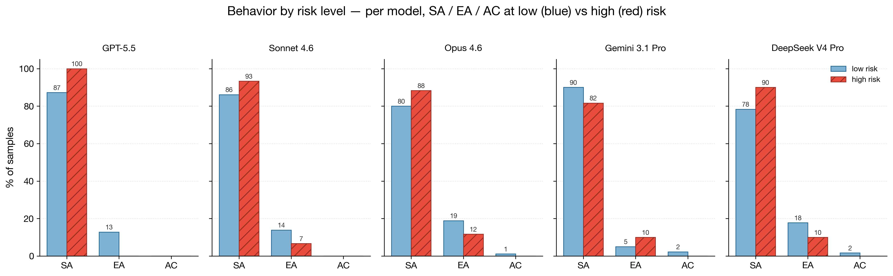
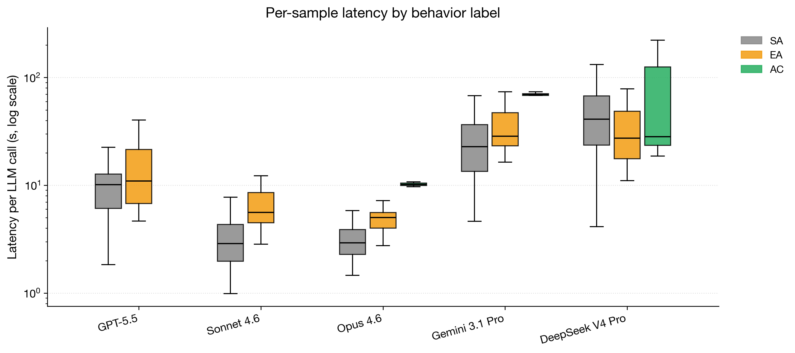
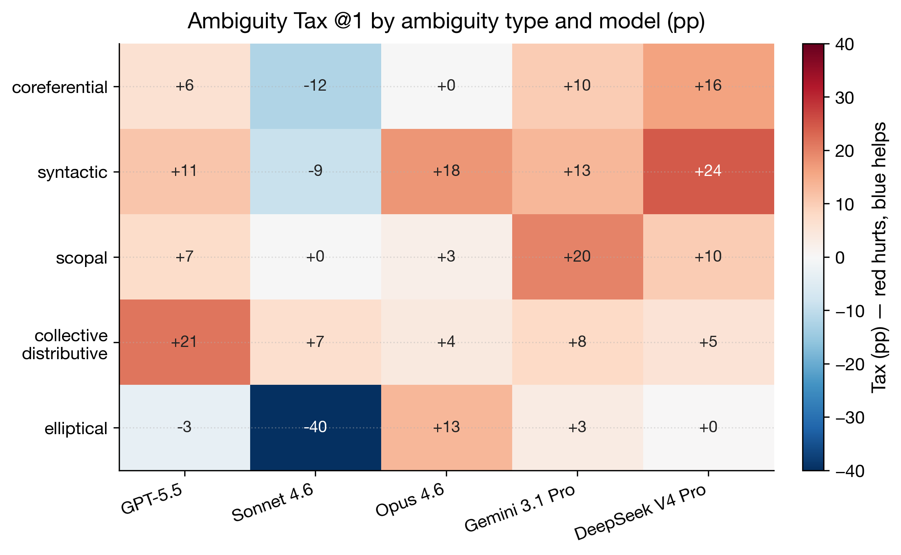
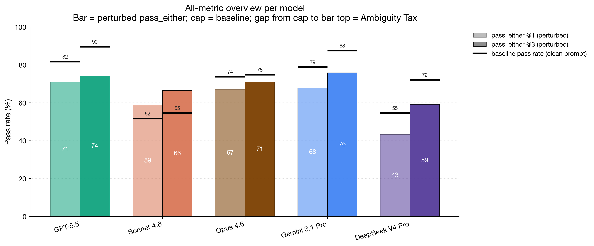
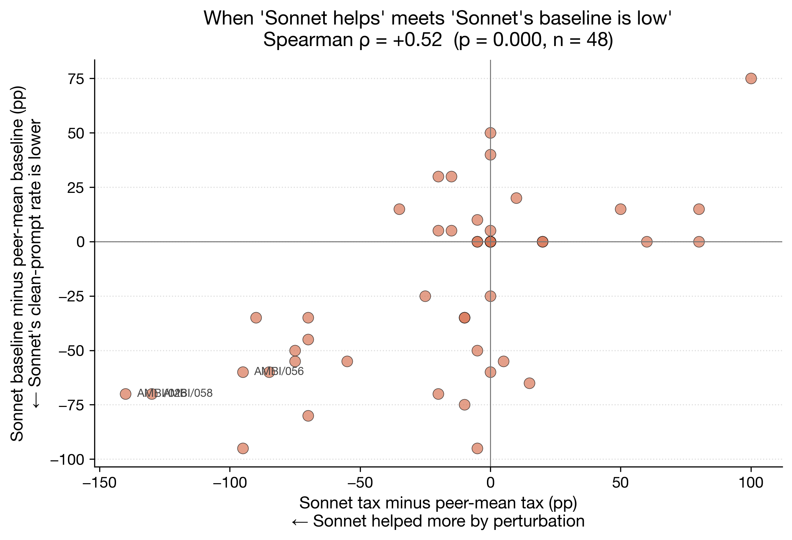

# AmbiCode-Eval

**A benchmark of 48 coding tasks measuring how SOTA LLMs handle linguistically ambiguous prompts.**

Each item pairs a clean coding prompt with a perturbed version that injects a single natural-language ambiguity (coreferential, syntactic, scopal, collective/distributive, or elliptical). Two reference solutions and a 2 × 2 sandbox-verified test pair attach to every item, so pass-rate loss after perturbation can be cleanly attributed to ambiguity rather than to model instability.

> **Status (2026-05-06)**: project complete. 5 SOTA models evaluated end-to-end (GPT-5.5, Claude Sonnet 4.6, Claude Opus 4.6, Gemini 3.1 Pro, DeepSeek V4 Pro). Three findings below.

---

## Where to read what

| What you want | Where it lives |
|---|---|
| **Findings & insights (this README)** | scroll down ↓ |
| **Pipeline diagrams** (benchmark creation + evaluation, with metric formulas) | [`docs/pipeline_diagrams.md`](docs/pipeline_diagrams.md) |
| **Use the benchmark in your own pipeline** | [`docs/benchmark_guide.md`](docs/benchmark_guide.md) |
| **How v2 was built** (Stage 1.5 quality gate, bilateral naturalness, opt-out) | [`docs/benchmark_generated_v2.md`](docs/benchmark_generated_v2.md) |
| **Quality audit** (v1 issues + v2 build changelog) | [`docs/benchmark_audit.md`](docs/benchmark_audit.md) |
| **Full prose findings + audit trail** | [`docs/findings.md`](docs/findings.md) |
| **Milestone analysis with all 14 figures** | [`notebooks/milestone_analysis.ipynb`](notebooks/milestone_analysis.ipynb) |
| **Internal deep-dive (sanity checks + AC sample gallery)** | [`notebooks/internal_result_report.ipynb`](notebooks/internal_result_report.ipynb) |
| **Phase status & deliverables** | [`docs/project_status.md`](docs/project_status.md) |

---

## What an item looks like

**Anchor**: DS-1000 / Pandas — reverse a column-of-lists and concatenate.

**Clean prompt** (unambiguous, includes a worked example):
> *"I want to **reverse each list** and concatenate these lists into one string like `'3,2,1,5,4'`."*

**Perturbed prompt** (Stage-1 rewrite — no example, definite-article + plural):
> *"I want to **reverse the lists** and concatenate them into one string."*

The phrase *"reverse the lists"* now admits two readings:

| | **Interpretation A** (canonical) | **Interpretation B** |
|---|---|---|
| Reading | distributive | collective |
| Operation | reverse each row's list, then flatten | reverse the *order* of rows, then flatten |
| `[[1,2,3],[4,5]]` → | `'3,2,1,5,4'` | `'4,5,1,2,3'` |

**Result on this item** (n=5 samples per model):

| Model | base/5 | passA/5 | passB/5 | tax (pp) |
|---|---|---|---|---|
| GPT-5.5 | 5 | 0 | 0 | 100 |
| Claude Sonnet | 5 | 0 | 0 | 100 |
| **Claude Opus** | 5 | **4** | 0 | **20** |
| Gemini 3.1 Pro | 5 | 0 | 0 | 100 |
| DeepSeek V4 Pro | 5 | 0 | 0 | 100 |

All five models solve the **clean** prompt 5/5. After perturbation, only Opus retains the canonical reading — the other four collapse. **No model ever produces interpretation B** (the collective reading is grammatically licensed but is not code anyone writes in practice).

This single item summarises the whole story: removing a worked example collapses behavior; per-model robustness varies dramatically; the alternative reading is rarely produced even when the prompt allows it.

Each item in the benchmark has the same shape — see [`docs/benchmark_guide.md`](docs/benchmark_guide.md) for the full schema.

---

## Findings

### 1. Models go silent when stakes are high (anti-calibration)

The naïve normative model says SA (silent assumption) should dominate when stakes are *low* (low friction, easy to fix later) and EA / AC should rise when stakes are *high* (flag the bet so the user can catch a wrong reading). **Five SOTA models do the opposite.**



| Model | low-risk EA + AC | high-risk EA + AC | Δ |
|---|---|---|---|
| GPT-5.5 | 12.8% | **0.0%** | **−12.8** |
| Sonnet | 13.9% | 6.7% | −7.2 |
| Opus | 20.0% | 11.7% | −8.3 |
| **Gemini** | **7.2%** | **10.0%** | **+2.8** |
| DeepSeek | 19.5% | 10.0% | −9.4 |

GPT-5.5 reaches **100% silent assumption on high-risk items**. **AC drops to 0% on high-risk for every model**, even Gemini and DeepSeek who produce non-zero AC overall. Only Gemini is calibrated — and only marginally (+2.8 pp).

A plausible mechanism is **interface suppression**: high-risk items in this benchmark are disproportionately DS-1000, whose tight harness format leaves little room for prose, mechanically silencing models that *might* clarify. Testing this requires rewriting high-risk items in MBPP-style prose-friendly format — left for future work.

The "AC ≈ 0" finding from earlier work becomes much sharper: AC is not just rare on average, it is **rare exactly when it should be highest**.

### 2. Active clarification is a deliberation product — but reasoning isn't sufficient



| Model | Median SA latency | Median AC latency | AC / SA ratio |
|---|---|---|---|
| Claude Opus 4.6 | 2.93 s | 10.23 s | **3.49 ×** |
| Gemini 3.1 Pro | 22.86 s | 69.84 s | **3.05 ×** |
| DeepSeek V4 Pro | 41.20 s | 28.28 s | 0.69 × |
| GPT-5.5 / Sonnet | — | (no AC) | — |

For Opus and Gemini, AC samples take **3 × longer** than SA — consistent with "AC requires extra inference compute spent surfacing the ambiguity."

DeepSeek V4 Pro **inverts the pattern**: its SA latency is the highest of any model–behavior combination (median **41 s**), but AC is *shorter* than SA. DeepSeek spends its reasoning budget on *deciding silently*, not on *surfacing the choice to the user*.

**Reasoning capacity is necessary** for AC > 0 (GPT-5.5 and Sonnet are 0%) **but not sufficient** — the inductive bias has to point toward "surface uncertainty" rather than "self-justify." This connects directly to the inference-time-scaling literature: more compute buys risk-awareness only when paired with the right prior.

### 3. There is no single best model on ambiguity



Each model has its own weak ambiguity type:

| Type | Hardest for | Easiest for |
|---|---|---|
| coreferential | DeepSeek (+16 pp) | Opus (0) |
| syntactic | DeepSeek (+24 pp) | Sonnet (−9) |
| scopal | Gemini (+20 pp) | Sonnet (0) |
| collective/distributive | GPT-5.5 (+21 pp) | Opus (+4) |
| elliptical | Opus (+13 pp) | Sonnet (−40) |

No type breaks all five models, and no model handles every type well. **"Ambiguity-handling ability" is not a scalar score** that admits a leaderboard, but a multi-dimensional skill bundle. Practitioners should **choose models by the ambiguity types in their prompts**, not by a single tax number.

The case study above (AMBI/043) is one corner of this matrix; the milestone notebook details two more (AMBI/040, AMBI/049) showing the same heterogeneity from different angles.

---

## Headline numbers



Per-model: lighter bar = `pass_either@1` (perturbed), darker bar = `pass_either@3`, black cap = `baseline_pass@k` on clean prompts. The **gap from cap to bar top is the Ambiguity Tax**.

| Model | Tax @1 (95 % CI) | Tax @3 (95 % CI) | A-bias | SA / EA / AC |
|---|---|---|---|---|
| GPT-5.5 | +10.8 [−2.9, +23.7] | **+15.4 [+1.9, +28.7]** | 79.5% | 90.4 / 9.6 / 0.0% |
| Claude Sonnet 4.6 ⚠️ | −7.1 [−21.2, +6.3] | −11.9 [−27.5, +3.1] | 75.2% | 87.9 / 12.1 / 0.0% |
| Claude Opus 4.6 | +6.7 [−6.7, +19.6] | +3.7 [−8.5, +15.8] | 80.7% | 82.1 / 17.1 / 0.8% |
| Gemini 3.1 Pro | +10.8 [−0.8, +23.3] | **+11.7 [+0.8, +24.0]** | 77.9% | 87.9 / 6.2 / 1.7% |
| DeepSeek V4 Pro | +11.2 [−1.2, +23.3] | +12.9 [−0.2, +26.0] | 73.8% | 81.2 / 15.8 / 1.2% |

CIs are item-level bootstraps (B = 2000). Bold = CI excludes 0 at α = 0.05.

**Headline metric**: Ambiguity Tax = `baseline_pass@k − pass_either@k`. A sample is "successful" under the perturbed condition if it satisfies test_a *or* test_b — both interpretations are valid given the ambiguous prompt, so requiring a specific one would be unfair.

---

## A methodology caveat we want to be honest about

Sonnet's negative aggregate tax (−7.1 pp @1) is **not** an ambiguity-handling story.



The dots cluster along the lower-left → upper-right diagonal: items where Sonnet is helped *more than its peers* by perturbation are also items where Sonnet's clean-prompt baseline is *lower than its peers*'. **Spearman ρ = +0.52, p < 0.001 across all 48 items.** On the 10 items where Sonnet's tax delta from peers is most negative, Sonnet's baseline is on average **60 pp lower** than the peer mean.

So:

> *Tax = baseline − pass_either is a valid measurement of **ambiguity-handling ability** only when the baseline reflects the model's ability on the canonical reading. When the baseline is dragged down by phrasing brittleness for reasons unrelated to ambiguity, the perturbation can incidentally repair the baseline shortfall, and Tax will be biased low. **Aggregate per-model claims should be qualified to the shared-baseline cohort** — items where every evaluated model achieves baseline ≥ τ.*

The math is sound; the interpretation requires comparable baselines across models. Full discussion in milestone notebook §9.7.

---

## How to use the benchmark

```python
import json
from src.data.model import BenchmarkItem

with open("data/benchmark/benchmark_v2_full.jsonl") as f:
    items = [BenchmarkItem.from_dict(json.loads(line)) for line in f if line.strip()]
print(len(items))   # 48
```

To evaluate a model end-to-end (baseline → perturbed → SA/EA/AC classification → analysis):

```bash
python scripts/run_full_pipeline.py \
    --model <alias> \
    --benchmark data/benchmark/benchmark_v2_full.jsonl \
    --n-samples 5 --temperature 0.8
```

Source-specific gotchas (MBPP function name extraction, DS-1000 `__SOLUTION__` wrapping, HumanEval `check()` invocation) are documented in [`docs/benchmark_guide.md`](docs/benchmark_guide.md). The auto-judge selection (Claude family ↔ GPT family for SA/EA/AC classification) is described in [`docs/project_status.md`](docs/project_status.md).

To reproduce the milestone (5 models in parallel, ~80 min on a Mac):
```bash
./scripts/run_milestone_eval.sh
python scripts/build_milestone_analysis.py
python scripts/build_milestone_notebook.py
```

---

## Requirements

- Python 3.9 +
- Docker Desktop (for sandbox execution)
- OpenRouter API key (`.env` with `OPENROUTER_API_KEY`)

## License

MIT 6.8610 NLP course project, Spring 2026.
