# Pipeline Diagrams

This document contains the two visual references for AmbiCode-Eval:

1. **Benchmark creation pipeline** — how a raw coding task becomes a verified benchmark item, including every quality gate.
2. **Evaluation pipeline** — how a model is evaluated on the benchmark and how each metric is computed.

Both diagrams are written in [Mermaid](https://mermaid.js.org/) (a plain-text diagram language).
GitHub renders them inline, so editing is just editing markdown.
At the bottom there's a one-liner for exporting to PNG / SVG when we need them for the poster or paper.

> **For teammates editing**: each Mermaid block is between fenced ```` ```mermaid ```` blocks.
> Edit the text between the fences, push, and GitHub will re-render automatically.
> Common edits + how to do them are in [§How to modify](#how-to-modify) at the end.

---

## 1 · Benchmark creation pipeline

Shows every stage that turns a raw coding task (HumanEval / MBPP / DS-1000)
into a verified benchmark item, with all quality gates and v2 reforms marked.

```mermaid
%% NAME: benchmark_pipeline
flowchart TD
    %% ── Inputs ─────────────────────────────────────────────
    Raw["Raw datasets<br/><i>HumanEval · MBPP · DS-1000</i>"]
    Norm["DS-1000 normalization<br/><i>845 tasks · Matplotlib excluded</i>"]
    Anchor["<b>Anchor selection</b><br/>5 judges × combined-eval call<br/>scores ambiguity feasibility per type"]
    Raw --> Norm --> Anchor

    %% ── Stage 1 ────────────────────────────────────────────
    S1["<b>Stage 1 · Perturbation generation</b><br/>3 SOTA models concurrent<br/>(gpt-5.4 · claude-sonnet · gemini-3.1-pro)<br/>──────────<br/>v2 reform B: <b>opt-out</b> when no natural ambiguity<br/>v2 reform C: <b>info-conservation</b> rules"]
    Anchor --> S1

    S1Out{"Per generator returns one of:<br/>• perturbed_prompt + interp_a + interp_b<br/>• null + opt-out reason<br/>• error"}
    S1 --> S1Out

    %% ── Stage 1.5 (NEW v2) ─────────────────────────────────
    S15["<b>Stage 1.5 · Quality gate</b> <i>(NEW v2 reform D)</i><br/>1 judge × 3 binary checks:<br/>• <b>leakage</b> (info added beyond clean?)<br/>• <b>B-naturalness</b> (would a programmer write B?)<br/>• <b>distinguishability</b> (A and B differ on common inputs?)"]
    S1Out -->|"valid generation"| S15

    GateA{"all 3 pass?"}
    S15 --> GateA
    GateA -- no --> Drop1["✗ dropped"]
    GateA -- yes --> S2

    %% ── Stage 2 ────────────────────────────────────────────
    S2["<b>Stage 2 · Bilateral naturalness gate</b><br/>5 judges × 2 yes/no questions:<br/>Q_A: <i>is interpretation A natural?</i><br/>Q_B: <i>is interpretation B natural?</i><br/>──────────<br/>v2 reform A: <b>both yes_a ≥ 3 AND yes_b ≥ 3</b><br/>(replaces v1 single-choice entropy gate)"]

    GateB{"yes_a ≥ 3 AND yes_b ≥ 3?"}
    S2 --> GateB
    GateB -- no --> Drop2["✗ dropped"]
    GateB -- yes --> S3

    %% ── Stage 3 ────────────────────────────────────────────
    S3["<b>Stage 3 · Test_b generation</b><br/>same SOTA model that wrote the perturbation<br/>writes <i>ref_solution_b + test_b</i><br/>(DS-1000 → self-contained code)"]
    S3 --> S4

    %% ── Stage 4 ────────────────────────────────────────────
    S4["<b>Stage 4 · Sandbox exclusivity gate</b><br/>Docker, no LLM calls<br/>──────────<br/>2 × 2 matrix must satisfy:<br/>ref_a × test_a → ✓ pass<br/>ref_a × test_b → ✗ fail<br/>ref_b × test_a → ✗ fail<br/>ref_b × test_b → ✓ pass"]
    GateD{"all 4 cells correct?"}
    S4 --> GateD
    GateD -- no --> Drop4["✗ dropped"]
    GateD -- yes --> Out["<b>benchmark_v2_full.jsonl</b><br/>48 verified items"]

    %% ── Styling ────────────────────────────────────────────
    classDef stage fill:#E8F1FA,stroke:#1F618D,stroke-width:1.5px,color:#000;
    classDef gate fill:#FCF3CF,stroke:#B7950B,stroke-width:1.5px,color:#000;
    classDef drop fill:#FADBD8,stroke:#922B21,stroke-width:1px,color:#000;
    classDef out fill:#D5F5E3,stroke:#1E8449,stroke-width:2px,color:#000;
    classDef in fill:#F2F3F4,stroke:#566573,stroke-width:1px,color:#000;

    class Raw,Norm in;
    class Anchor,S1,S15,S2,S3,S4 stage;
    class S1Out,GateA,GateB,GateD gate;
    class Drop1,Drop2,Drop4 drop;
    class Out out;
```



### Funnel statistics (HumanEval first run, 2026-05-05)

To give the diagram concrete numbers, here is the actual per-stage drop rate
from running the v2 pipeline on 127 high-feasibility HumanEval anchors:

| Stage | In | Out | Pass rate |
|---|---|---|---|
| Stage 1 (3 generators × 127) | — | 381 generations | — |
| ↳ Stage 1 errors | | 21 | — |
| ↳ Stage 1 opt-outs *(reform B)* | | **31** *(all Gemini)* | — |
| ↳ valid generations | | 329 | — |
| **Stage 1.5** quality gate *(reform D)* | 329 | 29 | **9 %** |
| **Stage 2** bilateral naturalness *(reform A)* | 29 | 3 | **10 %** |
| **Stage 4** sandbox exclusivity | 3 | 2 | 67 % |
| **Final benchmark items** | 127 anchors | 2 | **1.6 %** yield |

The aggressive Stage 1.5 + Stage 2 filtering (combined ~1 %) is the v2's signature contribution: most v1-style generations would have been admitted by the old entropy gate but get rejected here as *contrived B*, *info leakage*, or *both fail bilateral*.

---

## 2 · Evaluation pipeline

Shows how a single model is evaluated on the benchmark and how each metric is
computed. Reads left-to-right.

```mermaid
%% NAME: evaluation_pipeline
flowchart LR
    %% ── Inputs ─────────────────────────────────────────────
    BM[("<b>benchmark_v2_full.jsonl</b><br/>48 items, each with<br/>prompt · perturbed_prompt<br/>test_code · test_a · test_b")]
    Cfg["<b>Model config</b><br/>alias · n_samples=5 · T=0.8"]

    %% ── Phase 2: Inference (parallel) ──────────────────────
    subgraph P2["<b>Phase 2 · Inference</b>  (per model · n_samples per item · concurrent)"]
        direction TB
        Base["<b>Baseline</b><br/>prompt → LLM × n=5<br/>→ sandbox(test_code)<br/>→ pass_count"]
        Pert["<b>Perturbed</b><br/>perturbed_prompt → LLM × n=5<br/>→ <i>dual-blind</i> sandbox<br/>(test_a, test_b)<br/>→ passed_a, passed_b per sample"]
    end
    BM --> P2
    Cfg --> P2

    %% ── Phase 3: Behavioral Classification ─────────────────
    subgraph P3["<b>Phase 3 · Behavioral classification</b>"]
        direction TB
        Judge["<b>Judge LLM</b> (auto-picked<br/>to avoid same-family circularity)<br/>──────────<br/>Q1: did the model ask a question?<br/>Q2: did the model write code?<br/>Q3: did the model state an assumption?"]
        Map["<b>Deterministic mapping</b><br/>Q1 = yes → <b>AC</b><br/>Q2 + Q3 = yes → <b>EA</b><br/>Q2 alone → <b>SA</b><br/>else → unclassifiable"]
        Judge --> Map
    end
    P2 --> P3

    %% ── Phase 4: Aggregation ──────────────────────────────
    subgraph P4["<b>Phase 4 · Aggregation + statistics</b>"]
        direction TB
        Layer1["<b>Layer 1 · Test-level rates</b><br/>pass_a, pass_b, pass_either"]
        Layer2["<b>Layer 2 · Choice decomposition</b><br/>chose_a, chose_b, both, neither<br/>(mutually exclusive, sums to 1)"]
        Layer3["<b>Layer 3 · Unbiased pass@k</b><br/>pass@k = 1 − C(n−c, k) / C(n, k)<br/>k ∈ {1, 3}"]
        Tax["<b>Headline metric</b><br/>Tax = baseline_pass@k − pass_either@k<br/>(positive = ambiguity hurts)"]
        Boot["<b>Bootstrap 95% CI</b><br/>item-level resample × B = 2000<br/>per-model error bars on Tax"]
        Bias["<b>A-bias</b><br/>chose_a / (chose_a + chose_b)<br/>among decisive samples"]
    end
    P3 --> P4

    Out[("<b>data/results/milestone/</b><br/>summary.json · per_item.csv<br/>by_type.csv · by_risk.csv<br/>+ 14 figures (PNG, PDF)")]
    P4 --> Out

    %% ── Styling ────────────────────────────────────────────
    classDef phase fill:#E8F1FA,stroke:#1F618D,stroke-width:1.5px,color:#000;
    classDef io fill:#F2F3F4,stroke:#566573,stroke-width:1px,color:#000;
    classDef metric fill:#FCF3CF,stroke:#B7950B,stroke-width:1px,color:#000;
    classDef out fill:#D5F5E3,stroke:#1E8449,stroke-width:2px,color:#000;

    class P2,P3 phase;
    class BM,Cfg io;
    class P4,Layer1,Layer2,Layer3,Tax,Boot,Bias,Map metric;
    class Out out;
```



### Metric reference card

| Metric | Formula | Reading |
|---|---|---|
| `pass_a_rate` | `Σ pass_a_count / Σ n_samples` | fraction of samples that satisfy interpretation A |
| `pass_b_rate` | `Σ pass_b_count / Σ n_samples` | … interpretation B |
| `pass_either_rate` | `Σ pass_either_count / Σ n_samples` | satisfies A *or* B |
| `chose_a_rate` | `Σ chose_a_count / Σ n_samples` | satisfies *only* A → model picked A |
| `chose_b_rate` | `Σ chose_b_count / Σ n_samples` | satisfies *only* B → model picked B |
| **`pass@k`** *(Chen et al. 2021)* | `1 − C(n−c, k) / C(n, k)`, then averaged across items | unbiased pass@k from n samples per item |
| **`Ambiguity Tax @k`** | `baseline_pass@k − pass_either@k` | drop in pass-rate after perturbation; positive = ambiguity hurts |
| **`A-bias`** | `chose_a / (chose_a + chose_b)` | bias toward canonical reading among decisive samples |
| **Behavioral distribution** | counts of SA / EA / AC / unclassifiable | fraction of samples in each behavior class |

### Why dual-blind sandboxing

Under the perturbed prompt, *both* interpretations A and B are valid given the
ambiguous wording. We therefore evaluate every sample against *both* test_a
and test_b and treat a sample as "successful" if it satisfies *either*. This
prevents penalising a model that picks the (also-valid) B reading.

The 4 mutually-exclusive outcomes per sample:

| passed_a | passed_b | bucket | interpretation |
|---|---|---|---|
| ✓ | ✗ | `chose_a` | model picked A |
| ✗ | ✓ | `chose_b` | model picked B |
| ✓ | ✓ | `both` | tests can't distinguish (excluded from A-bias) |
| ✗ | ✗ | `neither` | code error / wrong reading / output-format mismatch |

---

## How to modify

The diagrams are plain text — open this file in any editor.

### Common edits

**Rename a stage** — just change the label inside the brackets:
```
S2["<b>Stage 2 · Bilateral naturalness gate</b>..."]
```

**Add a new stage** — declare a node, then connect it with arrows:
```
NewStage["<b>Stage 1.7 · Foo</b><br/>...description..."]
S15 --> NewStage --> S2
```

**Re-color** — adjust the `classDef` lines at the bottom:
```
classDef stage fill:#E8F1FA,stroke:#1F618D,...
                  ^bg     ^border
```

**Re-route an arrow** — find the source `--> destination` line and swap.
Edge labels go between pipes: `A -->|label| B`.

**Add a quality gate** — use a diamond (`{ ... }`) for the decision and two outgoing edges:
```
NewGate{"all 3 pass?"}
ProducerStage --> NewGate
NewGate -- yes --> NextStage
NewGate -- no --> Drop["✗ dropped"]
```

GitHub re-renders Mermaid on every push. No build step is required.

### Render to PNG / SVG (for poster, paper)

We need static PNGs only when we hand the diagram to LaTeX or InDesign. Two options:

**Option A — npx mermaid-cli** (zero install, runs once):
```bash
# from repo root
npx -y @mermaid-js/mermaid-cli -i docs/pipeline_diagrams.md -o /tmp/pipeline.png
# produces one PNG per Mermaid block
```

**Option B — convenience wrapper script** (writes to `data/results/figures/`):
```bash
./scripts/render_diagrams.sh   # see scripts/render_diagrams.sh
```

The wrapper extracts each ```` ```mermaid ```` block from this file and renders it
to both PNG (300 dpi) and SVG, named after the section heading.

### When you change a diagram, also update:

- [`README.md`](../README.md) — if the change affects findings or the case-study story
- [`docs/findings.md`](findings.md) — if a metric definition changed
- [`docs/benchmark_generated_v2.md`](benchmark_generated_v2.md) — if the benchmark-creation
  pipeline (diagram 1) changed
- [`docs/project_status.md`](project_status.md) — if a phase moved status

The set of files is small enough that grep helps: `grep -rn "Stage 1.5" docs/`.
